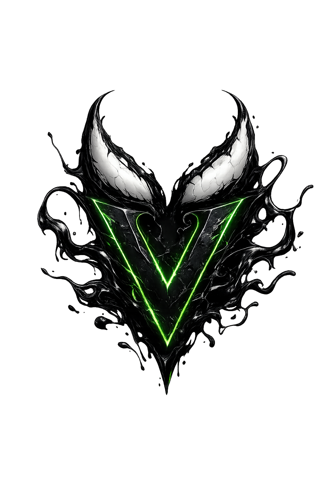
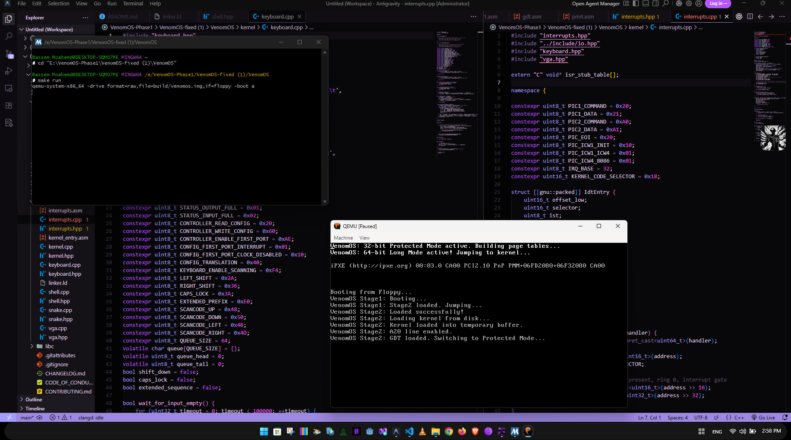
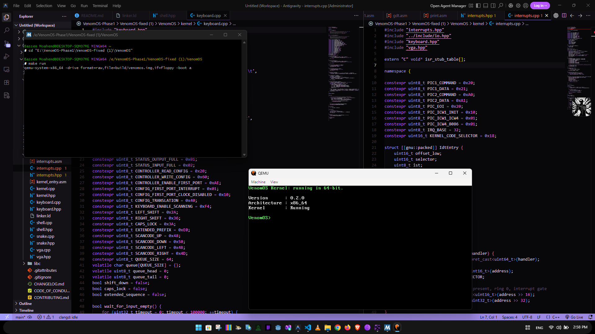
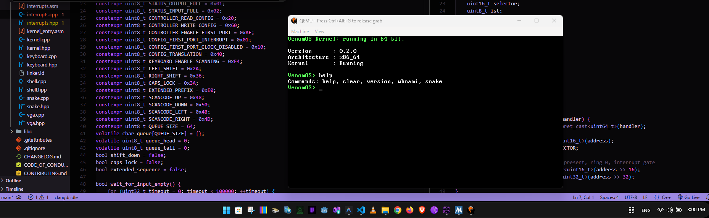
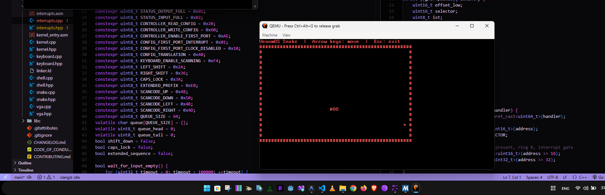

<div align="center">
  
  <h1 align="center">VenomOS 𝐕🕷️🕸️</h1>
  <p align="center"> VenomOS is a 64-bit educational operating system built from scratch using Assembly (NASM) and Modern C++. It features a custom BIOS bootloader, Long Mode support, a freestanding kernel, interrupt handling, PS/2 keyboard driver, VGA terminal, interactive shell, and a built-in Snake game.</p>
</div>

<div align="center">

<div align="center">
  
  
  
  <br>
  
  
  <br>
   
</div>
<br>

<div align="center">
  
  [](https://instagram.com/@bassemmohamed_0)
  [](https://reddit.com/user/00xBassem)
  [](https://x.com/@Basem2Mohamed)
  
</div>
<p align="center">Made possible by <a href="https://bassemmohamed.pages.dev/"><strong>BassemMohamed</strong></a></p>

A 64-bit educational operating system built completely from scratch using **Assembly** and **Modern C++**.

No external operating system libraries.  
No GRUB.  
No Limine.  
No UEFI Framework.

Everything boots directly from BIOS.

</div>

# Screenshots
### Booting <br>


### VenomOS <br>


### Commands <br>


### Snake <br>


# Features

-  Custom Stage 1 Bootloader
-  Custom Stage 2 Bootloader
-  BIOS Disk Loading
-  A20 Line Enable
-  Global Descriptor Table (GDT)
-  Protected Mode Transition
-  Long Mode (64-bit)
-  Custom Linker Script
-  Freestanding C++17 Kernel
-  VGA Text Terminal
-  Interrupt Descriptor Table (IDT)
-  Hardware Interrupt Handling
-  PS/2 Keyboard Driver
-  Interactive Command Shell
-  Built-in Snake Game
-  Fully bootable disk image
-  QEMU Ready

---

# Boot Process

```text
BIOS
 │
 ▼
Stage 1 Bootloader
 │
 ▼
Stage 2 Bootloader
 │
 ├── Enable A20
 ├── Load GDT
 ├── Switch to Protected Mode
 ├── Setup Paging
 ├── Enter Long Mode
 │
 ▼
64-bit Kernel
 │
 ▼
Drivers
 │
 ▼
Interactive Shell
```

---

# Project Structure

```
VenomOS
│
├── boot/
│   ├── stage1.asm
│   ├── stage2.asm
│   ├── disk.asm
│   ├── gdt.asm
│   ├── a20.asm
│   └── print.asm
│
├── kernel/
│   ├── kernel.cpp
│   ├── kernel_entry.asm
│   ├── linker.ld
│   ├── interrupts.*
│   ├── keyboard.*
│   ├── shell.*
│   ├── snake.*
│   └── vga.*
│
├── include/
│
├── build/
│
└── Makefile
```

---

# Components

## Bootloader

The bootloader is divided into two stages.

### Stage 1

Responsible for:

- Initial BIOS startup
- Disk access
- Loading Stage 2
- Boot validation

---

### Stage 2

Responsible for:

- Enabling the A20 line
- Loading the Global Descriptor Table
- Switching to Protected Mode
- Configuring Long Mode
- Loading the 64-bit kernel
- Jumping into C++ code

---

# Kernel

The kernel is written in **freestanding C++17**.

Current responsibilities include:

- Kernel initialization
- Terminal setup
- Driver initialization
- Interrupt initialization
- Launching the interactive shell

---

# Keyboard Driver

Features:

- PS/2 keyboard support
- Interrupt driven input
- Character translation
- Shell integration
- Snake game controls

---

# VGA Driver

The VGA subsystem provides:

- Colored text output
- Cursor management
- Screen clearing
- Formatted terminal output

---

# Interrupt System

Implemented features include:

- Interrupt Descriptor Table (IDT)
- Assembly interrupt stubs
- C++ interrupt handlers
- Keyboard IRQ handling
- Timer support

---

# Shell

The operating system includes a simple interactive shell.

Current commands:

| Command | Description |
|----------|-------------|
| help | Show available commands |
| clear | Clear the screen |
| version | Show OS version |
| whoami | Display current user |
| snake | Launch Snake game |

---

# Snake Game

A simple built-in Snake implementation demonstrates:

- Real-time keyboard input
- Screen rendering
- Game loop
- Collision detection
- Integration with the kernel shell

---

# Build Requirements

- NASM
- x86_64-elf GCC Toolchain
- x86_64-elf LD
- GNU Make
- QEMU

---

# Build

```bash
make
```

---

# Run

```bash
make run
```

---

# Technologies

- NASM Assembly
- C++17
- Freestanding Environment
- Custom Linker Script
- BIOS Boot
- x86_64 Architecture
- QEMU

---

# Current Status

Implemented:

- Bootloader
- Long Mode
- Kernel
- VGA
- Keyboard
- Interrupts
- Shell
- Snake

Planned:

- Physical Memory Manager
- Heap Allocator
- Virtual Memory Manager
- FAT File System
- ATA Driver
- Process Scheduler
- Multitasking
- User Mode
- ELF Loader
- System Calls

---

# Purpose

VenomOS is an educational operating system project created to explore low-level software development, operating system internals, bootloaders, CPU architecture, memory management, interrupt handling, and kernel programming from scratch.

---

# License

MIT License

---

<div align="center">

Made with Bassem Mohamed using Assembly and Modern C++

</div>
